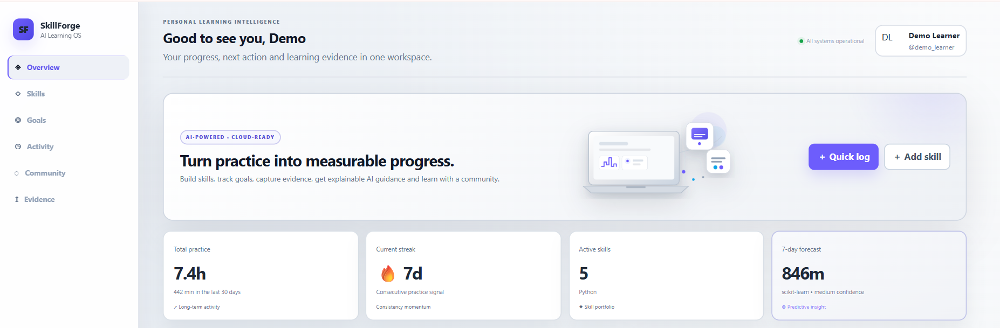
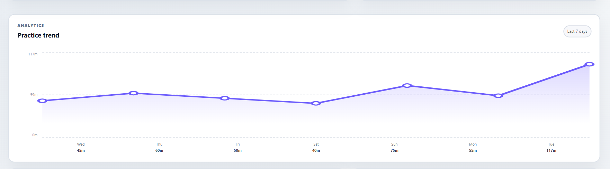
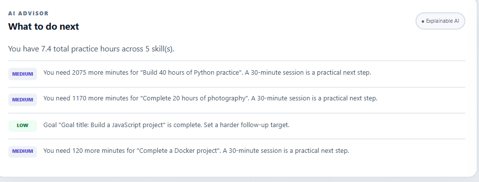
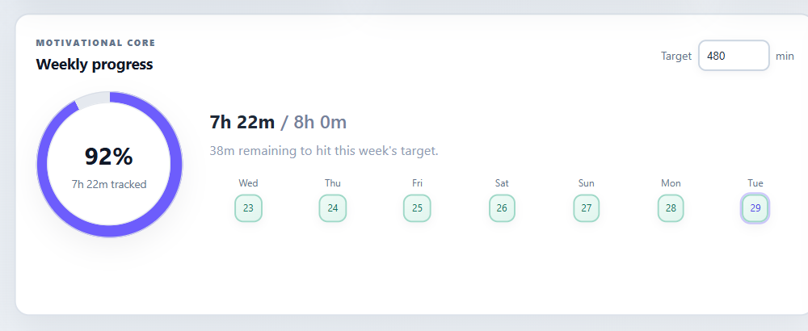
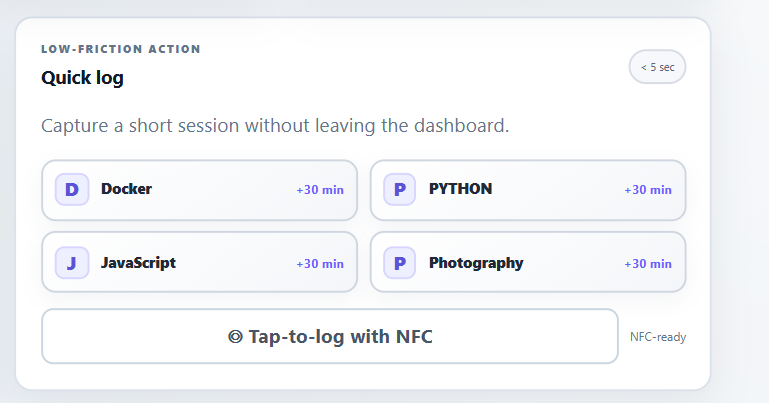
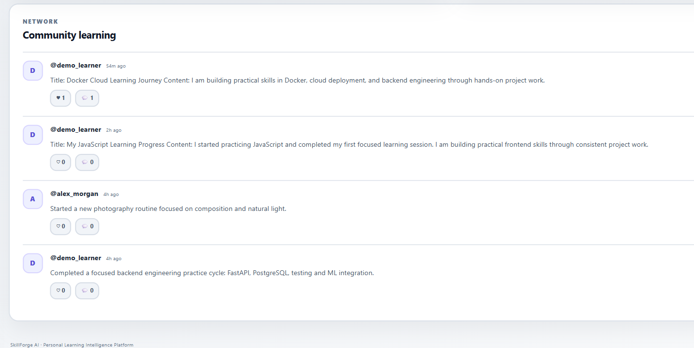
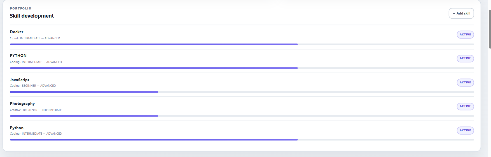
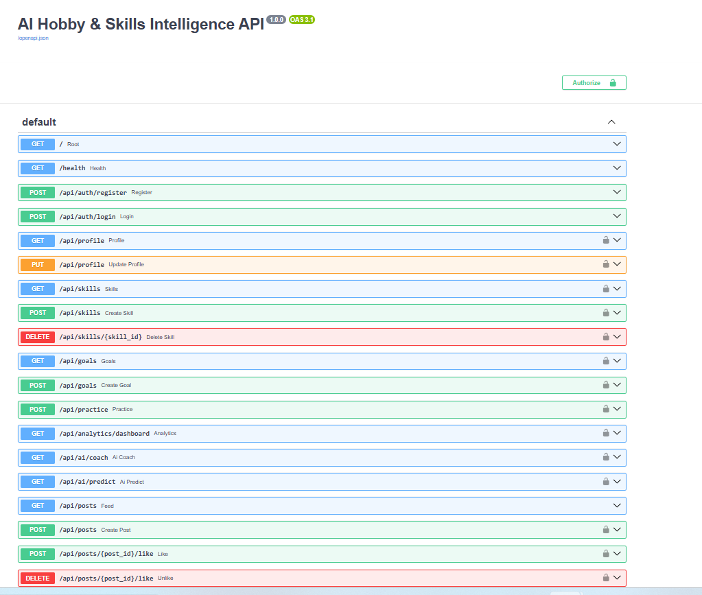

# 🚀 AI Hobby & Skills Intelligence Platform

<p align="center">

  

  

  

  

  

  

  

  

</p>

<p align="center">

  <strong>AI • Cloud Computing • Full-Stack Development • REST APIs • Analytics • PostgreSQL • Object Storage • Docker</strong>

</p>

<p align="center">

  <b>Industry-Oriented Cloud Computing & AI Project</b>

</p>

---

## 📌 Overview

**AI Hobby & Skills Intelligence Platform** is a full-stack, cloud-oriented learning and skill development platform designed to help users manage their skills, learning goals, practice sessions, progress analytics, achievements, and community interactions from a centralized application.

The platform combines:

- 👤 User profiles
- 🧠 Skill management
- 🎯 Learning goals
- ⏱️ Practice tracking
- 📊 Progress analytics
- 🔥 Streak tracking
- 🏆 Gamification and achievements
- 🤖 AI-assisted learning insights
- 📈 Practice prediction
- 💬 Community posts
- ❤️ Likes and comments
- 📁 Learning evidence uploads
- ☁️ PostgreSQL persistence
- 🗄️ S3-compatible object storage
- 🔐 Authentication and authorization
- 🐳 Docker-based deployment
- 🧪 Automated testing
- 🔄 GitHub Actions CI workflow

The project was designed to demonstrate practical **Cloud Computing, Backend Engineering, Full-Stack Development, AI/ML integration, REST API development, Database Engineering, Object Storage, Containerization, Testing, and DevOps** concepts.

---

# 🎯 Problem Statement

Learners often manage their skills, goals, practice sessions, achievements, and learning evidence using multiple disconnected tools.

This creates several problems:

- Learning progress becomes difficult to track.
- Practice consistency is not visible.
- Goals are not connected to measurable activity.
- Learning evidence is scattered across devices.
- Users lack centralized analytics.
- Community learning and accountability are limited.
- Personalized learning recommendations are difficult to maintain.

The platform addresses these problems by providing a centralized cloud-oriented system for managing and analyzing learning activity.

---

# 💡 Proposed Solution

The platform creates a unified learning workflow:

```text
User
 │
 ▼
Register / Login
 │
 ▼
Create Profile
 │
 ▼
Add Skills
 │
 ▼
Set Learning Goals
 │
 ▼
Log Practice Sessions
 │
 ▼
Store Data in PostgreSQL
 │
 ▼
Calculate Analytics
 │
 ▼
Generate AI-Assisted Insights
 │
 ▼
Upload Learning Evidence
 │
 ▼
Store Files in Object Storage
 │
 ▼
Share Learning Updates
 │
 ▼
Community Feed
 │
 ├── Likes
 └── Comments
```

---

# ⭐ Key Features

## 👤 1. User Profile Management

Users can maintain a learning-focused profile containing:

- Name
- Username
- Bio
- Learning information
- Skill portfolio

Profile information can be used as part of personalized dashboard experiences.

---

# 🧠 2. Skill Management

Users can create and manage skills.

Each skill can contain:

- Skill name
- Category
- Current level
- Target level
- Description

Supported categories include:

```text
Coding
Cloud
DevOps
Data
AI/ML
Creative
Music
Fitness
Other
```

Example:

```text
Skill: Python
Category: Coding
Current Level: Intermediate
Target Level: Advanced
```

---

# 🎯 3. Learning Goal Management

Users can create measurable learning goals associated with their skills.

A goal contains:

- Target skill
- Goal title
- Target practice duration
- Progress information

Example:

```text
Goal:
Complete 40 hours of Python practice

Target:
2400 minutes
```

This converts learning objectives into measurable targets.

---

# ⏱️ 4. Practice Session Tracking

Users can record individual practice sessions.

Each session can include:

- Skill
- Duration
- Activity
- Notes
- Practice date/time

Example:

```text
Skill: Python
Duration: 60 minutes
Activity: FastAPI API development
Notes: Implemented authentication endpoints
```

Practice data becomes the foundation for analytics and AI-assisted insights.

---

# 📊 5. Learning Analytics

The platform converts raw practice data into meaningful learning metrics.

Analytics include:

- Total practice time
- Weekly practice activity
- Practice trends
- Current streak
- Goal progress
- Active skills
- Recent activity
- Gamification indicators

The dashboard provides visual representations of learning activity.

---

# 📈 6. Practice Trend Visualization

The dashboard includes a practice-trend visualization that represents recent practice activity.

Example flow:

```text
Practice Sessions
       ↓
Analytics Service
       ↓
Daily Aggregation
       ↓
Practice Trend
       ↓
Dashboard Visualization
```

This helps users understand consistency instead of viewing only raw session records.

---

# 🔥 7. Streak Tracking

The application tracks learning consistency using practice activity.

The dashboard can display:

- Current streak
- Weekly progress
- Practice activity
- Learning consistency

Streak information can be combined with goals and achievements to provide a more engaging learning experience.

---

# 🏆 8. Gamification & Achievements

The platform includes gamification-oriented functionality for learning engagement.

It supports concepts such as:

- Badges
- Milestones
- Practice consistency
- Streaks
- Achievement progress

Gamification creates a feedback loop between learning activity and visible progress.

---

# 🤖 9. AI-Assisted Learning Intelligence

The platform contains an AI-oriented service layer designed around user learning data.

## AI Learning Coach

The AI coach provides learning-oriented recommendations based on tracked activity.

```text
User Activity
      ↓
Skills + Goals + Practice Data
      ↓
AI Service
      ↓
Learning Recommendations
```

---

## 📈 Practice Prediction

The platform provides a prediction/forecast service based on practice activity.

This allows the dashboard to present forward-looking learning information rather than only historical statistics.

---

## 🎯 Personalized Learning Insights

The AI-oriented architecture can use:

- Skills
- Goals
- Practice activity
- Progress
- Learning patterns

to generate more contextual learning guidance.

---

## 📚 Skill Trend Data

The project also includes a skill-trend data service for incorporating external skill information into the learning intelligence layer.

---

# 💬 10. Community Learning

The platform includes a community feed where users can share learning updates.

Users can:

- Create posts
- View posts
- Like posts
- Remove likes
- Add comments
- View community activity

Example workflow:

```text
Practice Skill
     ↓
Complete Learning Activity
     ↓
Share Learning Update
     ↓
Community Feed
     ↓
Likes / Comments
```

---

# 📁 11. Learning Evidence Upload

Users can upload files as learning evidence.

Potential use cases include:

- Project screenshots
- Certificates
- Practice evidence
- Supporting documents
- Learning artifacts

The application separates structured application data from file storage.

---

# 🗄️ 12. Object Storage

The local deployment uses **RustFS** as an S3-compatible object-storage layer.

Architecture:

```text
Application
     │
     ▼
FastAPI Storage Service
     │
     ▼
RustFS
     │
     ▼
Object Storage
```

This demonstrates the cloud storage pattern of storing large files separately from relational application data.

---

# 🔐 13. Authentication & Authorization

The backend implements token-based authentication and user-specific access control.

Security components include:

- Password hashing
- Access tokens
- Authentication dependencies
- User-specific resource access
- Environment-based configuration
- Input validation
- CORS configuration

Sensitive configuration is kept outside the source code through environment variables.

---

# 🏗️ System Architecture

```text
                         ┌─────────────────────┐
                         │        USER         │
                         │     Web Browser     │
                         └──────────┬──────────┘
                                    │
                                    ▼
                         ┌─────────────────────┐
                         │   React + Vite      │
                         │      Frontend       │
                         └──────────┬──────────┘
                                    │
                              HTTP / REST
                                    │
                                    ▼
                         ┌─────────────────────┐
                         │       FastAPI       │
                         │       Backend       │
                         └──────────┬──────────┘
                                    │
              ┌─────────────────────┼─────────────────────┐
              │                     │                     │
              ▼                     ▼                     ▼
       ┌──────────────┐      ┌───────────────┐    ┌──────────────┐
       │ PostgreSQL   │      │ AI / Analytics │    │   RustFS     │
       │   Database   │      │    Services    │    │Object Storage│
       └──────────────┘      └───────────────┘    └──────────────┘
              │                     │                     │
              └─────────────────────┼─────────────────────┘
                                    │
                                    ▼
                         ┌─────────────────────┐
                         │ Community & Learning│
                         │      Features       │
                         └─────────────────────┘
```

---

# 🔄 Complete Data Flow

```text
User
 │
 ▼
React Frontend
 │
 ▼
Authentication
 │
 ▼
FastAPI REST API
 │
 ├───────────────┐
 │               │
 ▼               ▼
PostgreSQL     Object Storage
 │               │
 │               └── Learning Evidence
 │
 ├── Users
 ├── Skills
 ├── Goals
 ├── Practice
 ├── Posts
 ├── Likes
 └── Comments
 │
 ▼
Analytics Services
 │
 ▼
AI Services
 │
 ▼
Personalized Dashboard
```

---

# 🧰 Technology Stack

## Frontend

- React
- Vite
- JavaScript
- CSS
- REST API integration

## Backend

- Python
- FastAPI
- Pydantic
- SQLAlchemy
- Token-based authentication
- REST APIs

## Database

- PostgreSQL

## Object Storage

- RustFS
- S3-compatible storage architecture

## AI / Data

- Python-based AI service layer
- Practice analytics
- Prediction service
- Skill trend processing
- Personalized learning insights

## DevOps

- Docker
- Docker Compose
- Git
- GitHub
- GitHub Actions

## Testing

- Pytest
- FastAPI TestClient

---

# 🗂️ Project Structure

```text
AI-Hobby-Skills-Intelligence-Platform/
│
├── .github/
│   └── workflows/
│       └── ci.yml
│
├── backend/
│   ├── app/
│   │   ├── api/
│   │   │   ├── __init__.py
│   │   │   └── deps.py
│   │   │
│   │   ├── core/
│   │   │   ├── config.py
│   │   │   └── security.py
│   │   │
│   │   ├── db/
│   │   │   └── session.py
│   │   │
│   │   ├── models/
│   │   │   └── models.py
│   │   │
│   │   ├── schemas/
│   │   │   └── schemas.py
│   │   │
│   │   ├── services/
│   │   │   ├── ai.py
│   │   │   ├── analytics.py
│   │   │   ├── real_data.py
│   │   │   └── storage.py
│   │   │
│   │   └── main.py
│   │
│   ├── tests/
│   │   └── test_core.py
│   │
│   ├── Dockerfile
│   ├── pytest.ini
│   └── requirements.txt
│
├── frontend/
│   ├── public/
│   │   └── skillforge-learning-visual.svg
│   │
│   ├── src/
│   │   ├── components/
│   │   │   └── Card.jsx
│   │   │
│   │   ├── lib/
│   │   │   └── api.js
│   │   │
│   │   ├── pages/
│   │   │   ├── Dashboard.jsx
│   │   │   └── Login.jsx
│   │   │
│   │   ├── main.jsx
│   │   └── styles.css
│   │
│   ├── Dockerfile
│   ├── FRONTEND_UPGRADE_NOTES.md
│   ├── index.html
│   ├── package.json
│   └── vite.config.js
│
├── docs/
│   ├── ARCHITECTURE.md
│   ├── DEMO_SCRIPT.md
│   └── INTERVIEW.md
│
├── screenshots/
│   ├── dashboard-overview.png
│   ├── analytics.png
│   ├── ai_adviser.png
│   ├── community_learning.png
│   ├── progress.png
│   ├── quick_log.png
│   ├── skill_development.png
│   ├── api-swagger.png.png
│   └── ...
│
├── scripts/
│   ├── import_real_skill_trends.py
│   └── verify.ps1
│
├── .env.example
├── .gitignore
├── docker-compose.yml
└── README.md
```

---

# 🔌 REST API

The backend follows an API-driven architecture.

## 🔐 Authentication

```http
POST /api/auth/register
POST /api/auth/login
```

---

## 👤 Profile

```http
GET /api/profile
PUT /api/profile
```

---

## 🧠 Skills

```http
POST   /api/skills
GET    /api/skills
GET    /api/skills/{id}
PUT    /api/skills/{id}
DELETE /api/skills/{id}
```

---

## ⏱️ Practice

```http
POST /api/practice
GET  /api/practice
GET  /api/skills/{id}/practice
```

---

## 🎯 Goals

```http
POST /api/goals
GET  /api/goals
PUT  /api/goals/{id}
```

---

## 💬 Community Posts

```http
POST   /api/posts
GET    /api/posts
DELETE /api/posts/{id}
```

---

## ❤️ Social Interaction

```http
POST   /api/posts/{id}/like
DELETE /api/posts/{id}/like

POST /api/posts/{id}/comments
GET  /api/posts/{id}/comments
```

---

## 📁 File Upload

```http
POST   /api/files/upload
DELETE /api/files/{id}
```

---

## 📊 Analytics

```http
GET /api/analytics/dashboard
GET /api/analytics/activity
GET /api/analytics/gamification
```

---

## 🤖 AI Services

```http
GET /api/ai/coach
GET /api/ai/predict
```

---

## 📈 Skill Trends

```http
GET /api/trends
```

---

# 📖 API Documentation

FastAPI provides interactive Swagger/OpenAPI documentation.

After starting the application, open:

```text
http://localhost:8000/docs
```

Swagger can be used to:

- Explore API endpoints
- Inspect request schemas
- Test endpoints
- Review responses
- Understand API contracts

---

# 🐳 Docker Architecture

The project uses Docker Compose to orchestrate the local application stack.

```text
Docker Compose
│
├── frontend
│   └── React + Vite
│
├── backend
│   └── FastAPI
│
├── db
│   └── PostgreSQL
│
└── minio
    └── RustFS / S3-Compatible Storage
```

This creates an isolated and reproducible development environment.

---

# ⚙️ Installation & Setup

## Prerequisites

Install the following:

- Git
- Docker Desktop
- Docker Compose
- Modern web browser

For Windows development, Docker Desktop with WSL2 is recommended.

---

# 1️⃣ Clone the Repository

```bash
git clone https://github.com/sujalkrshaw/AI-Hobby-Skills-Intelligence-Platform.git
```

Enter the project:

```bash
cd AI-Hobby-Skills-Intelligence-Platform
```

---

# 2️⃣ Configure Environment Variables

Copy the example environment file.

### Windows PowerShell

```powershell
Copy-Item .env.example .env
```

### Linux / macOS

```bash
cp .env.example .env
```

Review the `.env` file and configure the required environment variables.

> ⚠️ Never commit `.env` to GitHub.

---

# 3️⃣ Start the Application

Build and start all services:

```bash
docker compose up -d --build
```

Check service status:

```bash
docker compose ps
```

Expected services:

```text
frontend
backend
db
minio
```

---

# 4️⃣ Open the Application

### Frontend

```text
http://localhost:5173
```

### Backend

```text
http://localhost:8000
```

### Swagger API

```text
http://localhost:8000/docs
```

### RustFS Console

```text
http://localhost:9001
```

---

# 🩺 Health Check

The backend provides:

```http
GET /health
```

Open:

```text
http://localhost:8000/health
```

A healthy deployment returns a response containing:

```json
{
  "status": "healthy",
  "database": "ok"
}
```

---

# 🧪 Testing

The backend contains automated tests using Pytest.

Run:

```bash
docker compose exec backend pytest
```

## Verified Result

```text
4 passed, 1 warning
```

The warning is a dependency deprecation warning from the Starlette/AnyIO test-client stack and does not represent a failed test.

---

# 🔍 Engineering Verification

The project was verified through the following workflow:

```text
Docker Build
      ↓
Container Startup
      ↓
PostgreSQL Health Check
      ↓
RustFS Health Check
      ↓
Frontend Runtime
      ↓
Backend Health API
      ↓
Automated Pytest Suite
```

Verified:

```text
Frontend Build       ✅
Frontend Runtime     ✅
FastAPI Backend      ✅
PostgreSQL           ✅
RustFS Storage       ✅
Health API           ✅
Automated Tests      ✅ 4 Passed
```

---

# 🔐 Security

The application follows several security-oriented development practices.

### Authentication

- Token-based authentication
- Password hashing
- Protected API access

### Authorization

- User-specific resource access
- Authenticated API dependencies

### Configuration Security

- Environment variables
- `.env` excluded from Git
- `.env.example` provided for configuration reference

### Input Security

- Pydantic request validation
- Structured API schemas
- File upload validation

### Storage Security

Object storage is separated from relational application data.

---

# 🔒 Environment Variables

The project uses environment variables for configuration.

Example:

```env
DATABASE_URL=your_database_url
SECRET_KEY=your_secret_key
POSTGRES_DB=your_database
POSTGRES_USER=your_user
POSTGRES_PASSWORD=your_password

MINIO_ENDPOINT=your_storage_endpoint
MINIO_ACCESS_KEY=your_access_key
MINIO_SECRET_KEY=your_secret_key
MINIO_BUCKET=your_bucket
```

Never commit production credentials, passwords, API keys, or secret tokens.

---

# 🗄️ Database Architecture

PostgreSQL stores structured application data.

Conceptually:

```text
User
 │
 ├── Skills
 │     │
 │     └── Goals
 │
 ├── Practice Sessions
 │
 ├── Posts
 │     ├── Likes
 │     └── Comments
 │
 └── Profile
```

The relational database provides persistent storage for application entities and their relationships.

---

# 📦 Object Storage Architecture

Large files are handled separately from relational application data.

```text
User
 │
 ▼
Frontend Upload
 │
 ▼
FastAPI
 │
 ▼
Storage Service
 │
 ▼
RustFS
 │
 ▼
Object Storage
```

This follows the common cloud architecture pattern:

```text
Structured Data → Database
Files / Media   → Object Storage
```

---

# 📊 Analytics Architecture

```text
Practice Sessions
       │
       ▼
Analytics Service
       │
       ▼
Aggregation
       │
       ├── Total Practice
       ├── Weekly Activity
       ├── Streak
       ├── Goal Progress
       └── Skill Activity
       │
       ▼
Dashboard
```

---

# 🤖 AI Architecture

```text
User Learning Data
       │
       ├── Skills
       ├── Goals
       ├── Practice
       └── Activity
       │
       ▼
AI Service Layer
       │
       ├── AI Coach
       ├── Prediction
       ├── Personalized Insights
       └── Skill Trends
       │
       ▼
Learning Dashboard
```

The AI layer is separated from the core database and API logic to keep the system modular and extensible.

---

# 💼 Industry Relevance

The project demonstrates engineering patterns applicable to:

- EdTech platforms
- Learning Management Systems
- Skill development applications
- SaaS platforms
- Community platforms
- Portfolio applications
- Habit and practice tracking systems
- User-generated-content platforms
- Analytics dashboards
- AI-assisted productivity applications

The project combines multiple engineering domains:

```text
Cloud Computing
       +
Full-Stack Development
       +
Backend Engineering
       +
Database Engineering
       +
Object Storage
       +
AI/ML
       +
Analytics
       +
Authentication
       +
Docker
       +
Testing
       +
CI/CD
```

---

# 📈 Scalability Considerations

The architecture can be extended for larger workloads.

## Backend Scaling

Potential approaches:

- Multiple backend containers
- Horizontal scaling
- Load balancing
- Stateless API services

## Database Scaling

Potential approaches:

- Managed PostgreSQL
- Connection pooling
- Database indexing
- Query optimization
- Read replicas

## Object Storage Scaling

Potential approaches:

- S3-compatible cloud storage
- CDN integration
- Storage lifecycle policies

## Analytics Scaling

Potential approaches:

- Background workers
- Job queues
- Scheduled analytics
- Cached metrics

## Community Feed Scaling

A larger community feed can evolve from database pagination toward:

```text
Indexed Queries
      ↓
Pagination
      ↓
Caching
      ↓
Background Processing
      ↓
Distributed Feed Architecture
```

---

# 🛡️ Failure Handling

Important failure scenarios include:

### Database Failure

The API should return an appropriate service error without exposing internal database details.

### Object Storage Failure

Failed uploads should be reported to the client rather than being treated as successful.

### Authentication Failure

Invalid or expired authentication tokens should result in an authentication error.

### Invalid Input

Pydantic validation prevents malformed request data from entering application logic.

### Backend Failure

The frontend should display an appropriate error state when the API becomes unavailable.

---

# 🔄 CI / Automation

The project contains:

```text
.github/workflows/ci.yml
```

This workflow supports automated project validation through GitHub Actions.

---

# 📸 Screenshots

## 🖥️ Dashboard



---

## 📊 Analytics



---

## 🤖 AI Advisor



---

## 📈 Progress Tracking



---

## ⚡ Quick Practice Logging



---

## 💬 Community Learning



---

## 🧠 Skill Development



---

## 🔌 API Documentation



---

# 🎬 Recommended Demo Flow

For a project demonstration:

```text
1. Open Application
        ↓
2. Login
        ↓
3. Show Dashboard
        ↓
4. Show Active Skills
        ↓
5. Add a Skill
        ↓
6. Create a Goal
        ↓
7. Log Practice
        ↓
8. Show Updated Analytics
        ↓
9. Show Practice Trend
        ↓
10. Show AI Advisor
        ↓
11. Show Prediction
        ↓
12. Upload Learning Evidence
        ↓
13. Show Community Feed
        ↓
14. Create Post
        ↓
15. Like / Comment
        ↓
16. Open Swagger API
        ↓
17. Show Docker Services
        ↓
18. Show Test Result
```

---

# 🎓 Learning Outcomes

This project provided practical experience in:

## Cloud Computing

- Cloud-oriented architecture
- Database services
- Object storage
- Service separation
- Containerization
- Environment-based configuration

## Backend Development

- FastAPI
- REST API design
- SQLAlchemy
- Authentication
- Authorization
- Request validation
- Service-layer architecture

## Frontend Development

- React
- Vite
- API integration
- Dashboard development
- Data visualization
- Client-side state management

## Database Engineering

- PostgreSQL
- Relational modeling
- User-specific data
- Skills
- Goals
- Practice sessions
- Community relationships

## AI / Data Engineering

- AI service abstraction
- Practice analytics
- Prediction
- Personalized learning insights
- Skill trend processing

## DevOps

- Docker
- Docker Compose
- Git
- GitHub
- GitHub Actions
- Containerized application development

## Testing

- Pytest
- FastAPI TestClient
- Health checks
- API validation
- Automated testing

---

# 🧩 Technical Challenges

## Challenge 1 — Multi-Service Architecture

The application requires multiple services to communicate correctly:

```text
React
  ↓
FastAPI
  ↓
PostgreSQL
  +
RustFS
```

Docker Compose provides a reproducible environment for these components.

---

## Challenge 2 — Data Relationships

Skills, goals, practice sessions, users, posts, likes, and comments must remain associated with the correct user and related entities.

---

## Challenge 3 — Object Storage Integration

Learning evidence needs to be handled separately from structured relational data.

---

## Challenge 4 — Analytics

Raw practice records must be converted into meaningful user-facing metrics.

---

## Challenge 5 — AI Integration

AI functionality needs to operate alongside the core application rather than becoming a disconnected feature.

---

# 🚀 Future Enhancements

Potential future improvements include:

- Real-time notifications
- Advanced recommendation models
- LLM-powered learning plans
- Semantic skill search
- Advanced content moderation
- Follow/follower system
- Private/public profile controls
- Redis caching
- Background job processing
- Production cloud deployment
- CDN integration
- Advanced monitoring
- Prometheus/Grafana observability
- Email notifications
- Mobile application
- WebSocket-based real-time community features
- Advanced recommendation ranking

---

# ⚠️ Project Scope

This repository represents an **industry-oriented academic and portfolio project** focused on demonstrating:

- Cloud Computing
- Full-Stack Development
- AI/ML-oriented services
- REST APIs
- PostgreSQL
- Object Storage
- Authentication
- Analytics
- Docker
- Testing
- CI/CD concepts

The included Docker environment is intended for local development and demonstration.

Production deployment would require additional infrastructure configuration such as:

- HTTPS/TLS
- Production secrets management
- Managed database
- Production object storage
- Backups
- Monitoring
- Rate limiting
- Production logging
- Scaling policies

---

# 📋 Project Status

| Component | Status |
|---|---|
| React Frontend | ✅ Implemented |
| Vite | ✅ Implemented |
| FastAPI Backend | ✅ Implemented |
| PostgreSQL | ✅ Implemented |
| Authentication | ✅ Implemented |
| Authorization | ✅ Implemented |
| User Profiles | ✅ Implemented |
| Skill Management | ✅ Implemented |
| Goal Management | ✅ Implemented |
| Practice Tracking | ✅ Implemented |
| Progress Analytics | ✅ Implemented |
| Practice Trend | ✅ Implemented |
| AI Coach | ✅ Implemented |
| Prediction Service | ✅ Implemented |
| Skill Trends | ✅ Implemented |
| Community Posts | ✅ Implemented |
| Likes | ✅ Implemented |
| Comments | ✅ Implemented |
| File Upload | ✅ Implemented |
| RustFS Object Storage | ✅ Implemented |
| Docker Compose | ✅ Implemented |
| Swagger / OpenAPI | ✅ Available |
| Automated Tests | ✅ 4 Passed |
| GitHub Actions | ✅ Configured |
| GitHub Repository | ✅ Published |

---

# 🧪 Verification Summary

Final verified local environment:

```text
Frontend
   ↓
Running on localhost:5173

Backend
   ↓
Healthy on localhost:8000

PostgreSQL
   ↓
Healthy

RustFS
   ↓
Healthy

Automated Tests
   ↓
4 passed, 1 warning
```

Backend health verification:

```text
status   = healthy
database = ok
```

---

# 🏷️ ATS / Technical Keywords

```text
Artificial Intelligence
AI
Machine Learning
Cloud Computing
Full Stack Development
Python
FastAPI
React
Vite
PostgreSQL
SQLAlchemy
REST API
RESTful API
JWT Authentication
Authentication
Authorization
Object Storage
S3 Compatible Storage
RustFS
Docker
Docker Compose
Git
GitHub
GitHub Actions
CI/CD
Pytest
API Testing
Data Analytics
Predictive Analytics
Personalized Learning
Skill Tracking
Goal Management
Practice Tracking
Community Platform
User Generated Content
File Upload
Cloud Architecture
Database Design
Backend Development
Frontend Development
API Integration
Containerization
DevOps
Cloud Storage
Database Management
Software Engineering
```

---

# 💼 Resume Project Description

You can describe this project on your resume as:

> **AI Hobby & Skills Intelligence Platform** — Built a full-stack cloud-oriented learning platform using React, FastAPI, PostgreSQL, Docker, and S3-compatible object storage, implementing authentication, skill/goal management, practice tracking, analytics, AI-assisted recommendations, prediction, community posts, likes/comments, and learning-evidence uploads; validated the backend with automated Pytest tests.

---

# 🎤 Interview Summary

### What is this project?

This is a cloud-oriented full-stack platform that helps users manage skills, goals, practice sessions, progress, achievements, and community learning.

### Why did you build it?

To demonstrate how Cloud Computing concepts can be combined with AI, analytics, REST APIs, databases, object storage, authentication, and containerization in one practical application.

### Why PostgreSQL?

Because the application contains structured relational entities such as users, skills, goals, practice sessions, posts, likes, and comments.

### Why object storage?

Files and learning evidence are better separated from structured relational data, so the project uses an S3-compatible object-storage architecture.

### Why FastAPI?

FastAPI provides a lightweight Python framework for building typed REST APIs with automatic OpenAPI documentation.

### Why Docker?

Docker provides reproducible environments and allows the frontend, backend, database, and object-storage services to run as coordinated containers.

### What does the AI component do?

The AI service layer provides learning-oriented coaching, practice prediction, personalized insights, and skill-trend functionality based on application data.

### How did you test it?

The backend was tested using Pytest and FastAPI TestClient. The final verified result was:

```text
4 passed, 1 warning
```

---

# 👨‍💻 Author

## Sujal Shaw

**Electronics & Communication Engineering Student**

Areas of interest:

- Cloud Computing
- Artificial Intelligence
- Machine Learning
- IoT
- Embedded Systems
- Python
- Full-Stack Development
- Backend Engineering

---

# 🔗 Repository

**GitHub:**

https://github.com/sujalkrshaw/AI-Hobby-Skills-Intelligence-Platform

---

# ⭐ Support

If you find the project useful:

- ⭐ Star the repository
- 🍴 Fork the repository
- 🐛 Report issues
- 💡 Suggest improvements
- 🤝 Contribute

---

